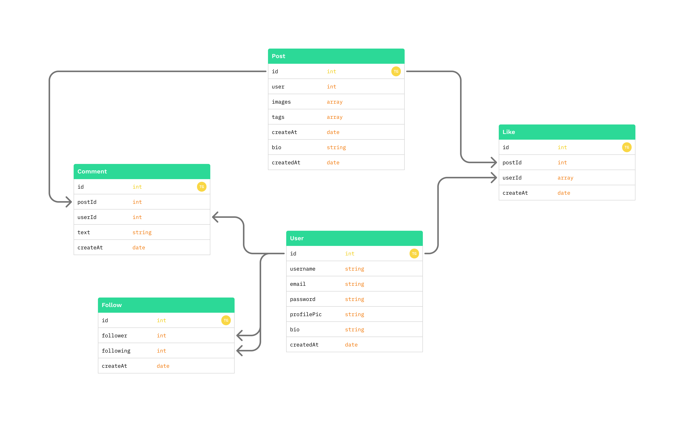
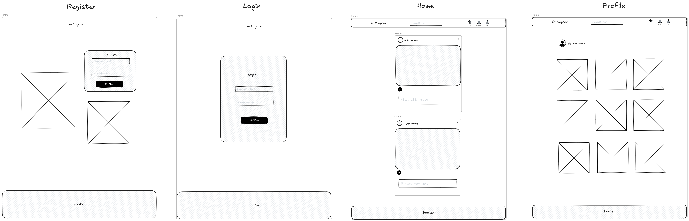

# ABP-Instagram

ABP-Instagram es una aplicación web de red social inspirada en Instagram, desarrollada como proyecto académico. Permite a los usuarios registrarse, iniciar sesión, crear publicaciones con imágenes y descripciones, dar "me gusta", comentar y seguir a otros usuarios.


## Miembros

- [Adrian Alvarado](https://gitlab.inf.edt.cat/a243469aa)
- [Sebastian Oliver](https://gitlab.inf.edt.cat/a220195lo)
- [Rhian Frances Estante](https://gitlab.inf.edt.cat/a220064re)
- [Qihao Lin](https://gitlab.inf.edt.cat/a220602ql)

## Tecnologías

### Backend


### Frontend


### Otros


## Características del Proyecto

- **Autenticación con JWT**
  Registro, login y manejo de sesiones seguras mediante tokens.
- **Gestión completa de posts**
  Crear, leer, dar like y comentar publicaciones.
- **Sistema de seguidores**
  Seguir o dejar de seguir usuarios, y consultar seguidores/seguidos.
- **API REST escalable y modular**
  Rutas organizadas por recursos, middlewares reutilizables y controladores limpios.
- **Subida de imágenes** _(opcional, si lo usas)_
  Soporte para imágenes en posts con almacenamiento local o en la nube.
- **Frontend con Create React App**
  Interfaz moderna, componentes reutilizables y manejo de estado eficiente.
- **Protección de rutas en el frontend**
  Acceso restringido basado en token.
- **Likes y comentarios**
  Interacciones sin recargar la página.

## Estructura del proyecto

### Raíz

```console
/
├── backend/
├── frontend/
├── docker-compose.yml
└── README.md
```

### Backend

```console
backend/
│
├── src/
│   │
│   ├── models/
│   │   ├── User.js
│   │   ├── Post.js
│   │   └── Follow.js
│   │
│   ├── controllers/
│   │   ├── postController.js
│   │   └── userController.js
│   │   ├── followController.js
│   │
│   ├── routes/
│   │   ├── userRoutes.js
│   │   ├── postRoutes.js
│   │   └── followRoutes.js
│   │
│   ├── middleware/
│   │   └── authMiddleware.js
│   │
│   └── server.js
│
├── package.json
├── public/
└── Dockerfile
```

### Frontend

```console
frontend/
│
├── public/
│   ├── index.html
│   ├── favicon.ico
│   └── assets/
│       └── (imágenes, íconos, etc.)
│
├── src/
│   ├── components/
│   │   ├── Posts/
│   │   │   ├── Post.js
│   │   │   ├── Like.js
│   │   │   ├── Comments.js
│   │   │   └── Caption.js
│   │   |
│   ├── pages/
│   │   ├── Feed.js
│   │   ├── Profile.js
│   │   ├── Login.js
│   │   └── Register.js
│   │
│   ├── utils/
│   │   └── simpleTimeAgo.js
│   │
│   ├── constants/
│   │   └── index.js
│   │
│   ├── App.js
│   ├── index.css
│   └── index.js
│
├── .env
├── package.json
├── README.md
└── package-lock.json
```

## Planificación y metodología


Para la organización y gestión del proyecto utilizamos **Scrum** como marco de trabajo ágil. Este método nos permite dividir el desarrollo en **sprints cortos**, priorizar tareas de forma iterativa y adaptarnos rápidamente a cambios o nuevas necesidades.

Toda la planificación, seguimiento y control del progreso la realizamos mediante **GitLab**, aprovechando:

- **Issues** para registrar y gestionar tareas, bugs y mejoras.
- **Milestones** para definir objetivos y fechas de entrega por sprint.
- **Labels** para clasificar el trabajo (frontend, backend, bug, feature, prioridad…).
- **Boards** de GitLab para visualizar el flujo de trabajo en columnas (To Do, Doing, Done).

Gracias a esta estructura, mantenemos una visión clara del estado del proyecto, facilitamos la colaboración entre miembros del equipo y aseguramos que cada entrega se realice dentro de los tiempos definidos.

## Diagrama de base de datos



## Wireframe



## 🔒 Seguridad

La seguridad es una parte fundamental del proyecto, por lo que se han implementado diversas medidas para proteger los datos de los usuarios y asegurar la integridad del sistema:

### **🔐 Hashing de Contraseñas (bcrypt)**

Utilizamos **bcrypt** para hashear las contraseñas antes de almacenarlas en la base de datos.
Esto garantiza que las contraseñas nunca se almacenen en texto plano y añade una capa adicional de protección mediante _salt_ y múltiples rondas de encriptación.

### **🛡️ Autenticación con JSON Web Tokens (JWT)**

La autenticación del usuario se gestiona mediante **jsonwebtoken** (JWT).
Cada usuario obtiene un token firmado que permite acceder a rutas protegidas.
El servidor valida la autenticidad del token en cada petición, manteniendo sesiones seguras sin almacenar información sensible en el backend.

### **🌐 CORS (Cross-Origin Resource Sharing)**

Se configura **CORS** para permitir únicamente solicitudes desde dominios autorizados.
Esto evita accesos no deseados desde orígenes no permitidos y contribuye a la protección de la API frente a ataques externos.

### **🔐 HTTPS**

Todo el tráfico entre el frontend y la API viaja mediante **HTTPS**, cifrando la comunicación y evitando que terceros puedan interceptar o modificar la información transmitida.
Con esto garantizamos la integridad y confidencialidad de los datos, especialmente durante procesos críticos como el login o el registro.

## 🔒 Seguridad

El proyecto implementa varias medidas para garantizar la protección de los datos:

- **bcrypt** para hashear contraseñas antes de guardarlas en la base de datos.
- **JWT (jsonwebtoken)** para gestionar la autenticación mediante tokens seguros.
- **CORS** configurado para permitir únicamente solicitudes desde orígenes autorizados.
- **HTTPS** para cifrar toda la comunicación entre el frontend y el backend.

## Api Rutas

| Método | Ruta                 | Descripción                           | Headers                             |
| ------ | -------------------- | ------------------------------------- | ----------------------------------- |
| POST   | `/users`             | Registrar un nuevo usuario            | —                                   |
| POST   | `/users/login`       | Iniciar sesión y obtener JWT          | —                                   |
| GET    | `/users/me`          | Obtener mi perfil                     | `Authorization: Bearer <JWT_TOKEN>` |
| GET    | `/users/:username`   | Obtener perfil de un usuario          | —                                   |
| GET    | `/posts`             | Obtener todos los posts               | —                                   |
| POST   | `/posts/me`          | Obtener mis posts                     | `Authorization: Bearer <JWT_TOKEN>` |
| GET    | `/posts/:username`   | Obtener posts de un usuario           | -                                   |
| POST   | `/posts`             | Crear un nuevo post                   | `Authorization: Bearer <JWT_TOKEN>` |
| DELETE | `/posts/:id`         | Eliminar un post                      | `Authorization: Bearer <JWT_TOKEN>` |
| POST   | `/posts/:id/like`    | Dar o quitar like a un post           | `Authorization: Bearer <JWT_TOKEN>` |
| GET    | `/posts/:id/like`    | Contar los likes de un post           | -                                   |
| GET    | `/posts/:id/isliked` | Verificar si ha dado like             | `Authorization: Bearer <JWT_TOKEN>` |
| POST   | `/posts/:id/comment` | Comentar un post                      | `Authorization: Bearer <JWT_TOKEN>` |
| POST   | `/users/:id/follow`  | Seguir o dejar de seguir a un usuario | `Authorization: Bearer <JWT_TOKEN>` |

## Instalación y Uso

1. Clonar el repositorio:

```bash
git clone https://gitlab.inf.edt.cat/dam/abp-25-26/estante-oliver-alvarado
cd estante-oliver-alvarado
```

2. Iniciar docker

```bash
docker compose up -d
```

## 🚀 Despliegue

[Abp-Instagram](https://tranquil-patience-production.up.railway.app/)

## Roadmap

- [x] Registro
- [ ] Login
- [ ] Crear post
